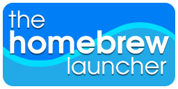

<!-- Will be Replaced in the Future with a Banner -->

<h1 align="center">DragonGod65</h1>

<!-- Links need to be changed to appear better -->

    
    
    
    
    
    

## 👋 About me

  <!--✨ Creating bugs since ... 
  📚 I'm currently learning ... 
  🯠Goals: ... 
  🎲 Fun fact: ...-->

 

<!-- Relevant Projects & Works-->
## 💼 Projects

 

<!-- Tools etc -->
## 📓 Languages, Frameworks and Tools
### 📜 Languages

    
    
    
    
    
    
    
    
    
    
    

### ⚙️ Frameworks & Engines

    
    
    <!--
    
    
    -->
    
    
    
    
    
    
    
    
    

### 🛠️ Tools

    
    
    
    
    

