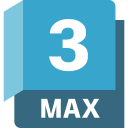

<!-- Will be Replaced in the Future with a Banner -->

    

<h1 align="center">Wyvern</h1>

Casual Developer

    
    
    
    
    
    

## 👋 About me

  <!--✨ Creating bugs since ... 
  📚 I'm currently learning ... 
  🯠Goals: ... 
  🎲 Fun fact: ...-->

 

<!-- Relevant Projects & Works-->
## 💼 Projects

 

<!-- Tools etc -->
<h2>📓 Languages & Skills</h2>
<h3 style="margin-bottom: 34px">📜 Languages</h3>

    
    
    
    
    
    

 

<h3 style="margin-bottom: 34px"> ⚙️ Frameworks & Engines </h3>

    
    
    
    

 

<h3 style="margin-bottom: 34px">🛠️ Tools</h3>

    
    
    
    
    

